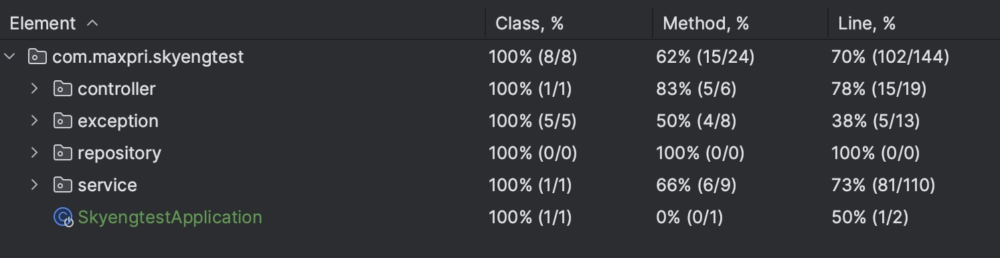

### swagger

swagger ui at - http://localhost:8080/swagger-ui/index.html

### db

there is flyway migrations to insert some mail offices automatically

### test coverage
model package was excluded

### war
war is called skyengtest.war
 
deployed it on tomcat 10.X

